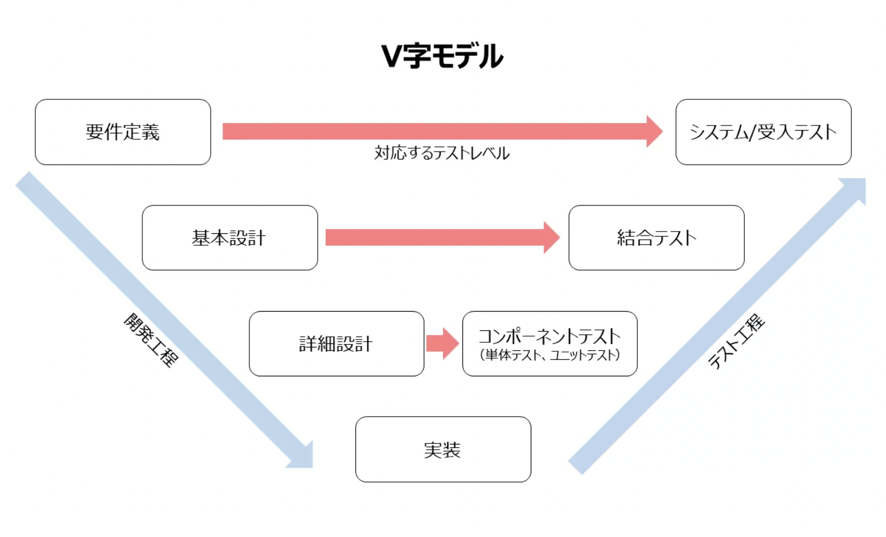

# V字モデル

### V字モデル（Vモデル・V-Model）とは

V字モデルとはソフトウェア開発手法の１つであり、主にウォーターフォール型開発において開発工程とテスト工程を詳細さのレベルに応じて対に並べ、各工程の対応関係を明示したモデルです。

### V字モデルを活用する品質面におけるメリット

１．適切なテスト内容を決定しやすい

２．テスト工程の進捗を管理しやすい

３．前工程の修正作業など「手戻り」リスクの軽減につながる

４．不具合の修正コストの削減につながる

[参考サイト](https://shiftasia.com/ja/column/v%E5%AD%97%E3%83%A2%E3%83%87%E3%83%AB%E3%81%A8%E3%81%AF/#:~:text=V%E5%AD%97%E3%83%A2%E3%83%87%E3%83%AB%E3%81%A8%E3%81%AF%E3%82%BD%E3%83%95%E3%83%88%E3%82%A6%E3%82%A7%E3%82%A2%E9%96%8B%E7%99%BA%E6%89%8B%E6%B3%95%E3%81%AE%EF%BC%91,%E3%82%92%E6%98%8E%E7%A4%BA%E3%81%97%E3%81%9F%E3%83%A2%E3%83%87%E3%83%AB%E3%81%A7%E3%81%99%E3%80%82)

