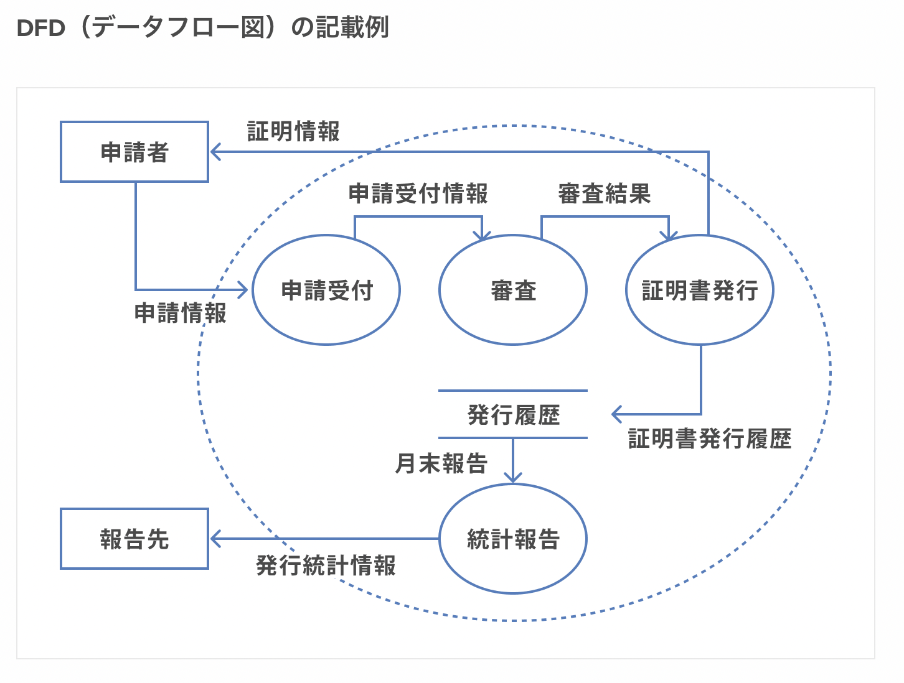
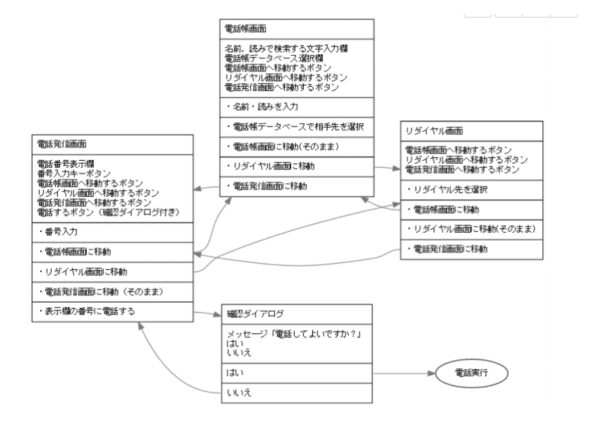

# 基本設計とは

要件定義をもとに、UI（ユーザーインターフェース）などの外側から見たシステムを設計するフェーズで。基本設計で行う作業内容は以下の通りです。

[参考資料](https://anken-hyouban.com/blog/2019/11/20/basic-design/)

・機能の洗い出し

> 要件定義でリスト化した機能の詳細まで決定する。例:アーカイブを難易度順に10個表示

・扱うデータを整理

  1.必要なデータをリスト化する

  2.tableに落とし込み

  3.データフロー図の作成

4.各画面毎にDBから表示されるデータと、DBに送信するデータの見える化

・画面のレイアウトを決める

> アニメーション、ボタンを押した時の挙動、リンク、メニューの中身、ページのタイトル、文字の配置、アイコンの配置などを決定！

> メインカラー、サブカラー、フォントカラー、アクセントカラーの決定！
