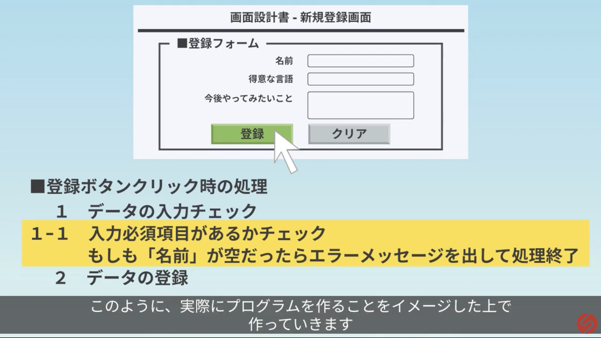
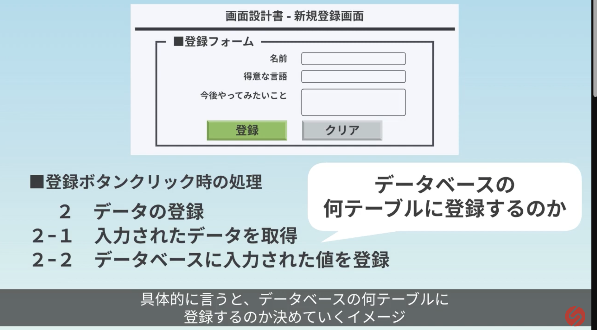
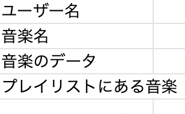
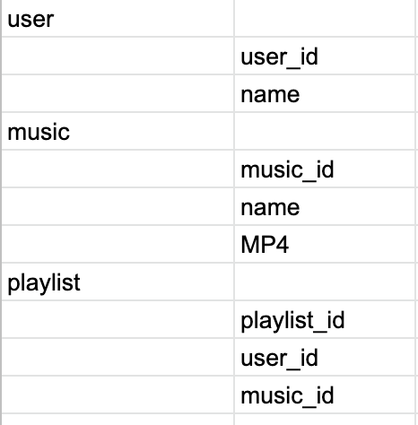
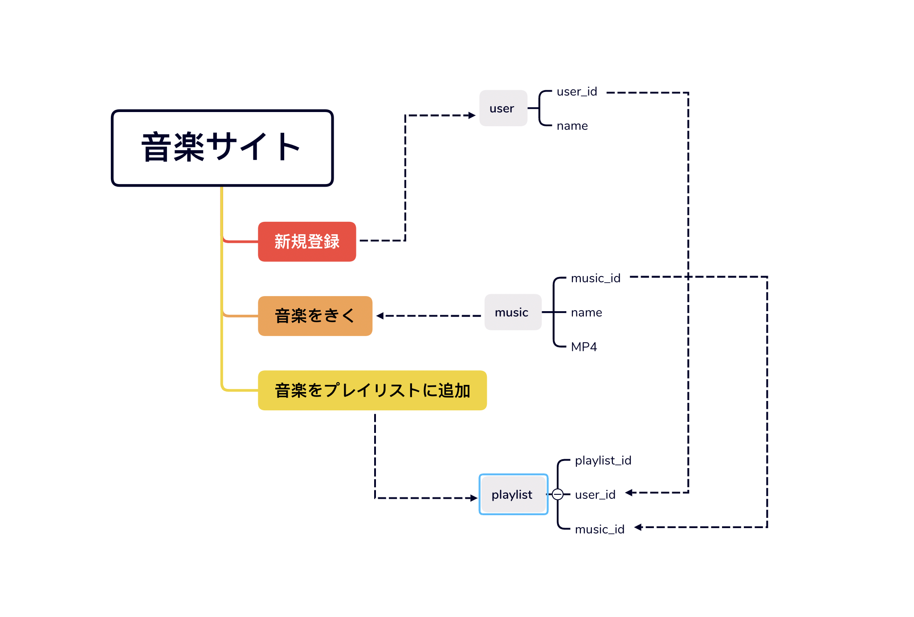
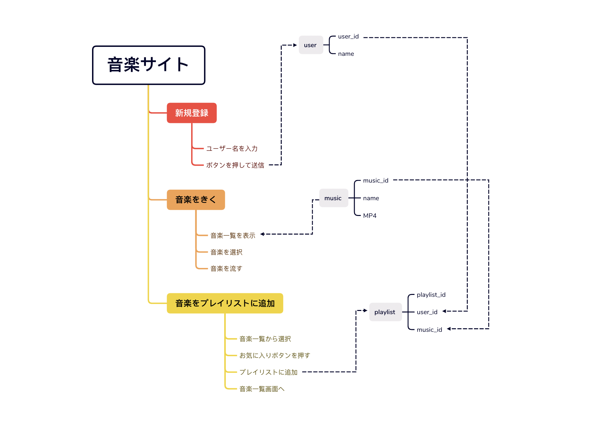

# 基本設計とは

要件定義をもとに、UI（ユーザーインターフェース）などの外側から見たシステムを設計する,内部のシステムを設計するフェーズで、基本設計で行う作業内容は以下の通りです。

[参考資料](https://anken-hyouban.com/blog/2019/11/20/basic-design/)

### 機能の洗い出し、詳細決定

> 実際に作る時に必要なシステムの詳細を決める。例:アーカイブを難易度順に10個表示

> function毎にプログラムの実際の処理の流れ、プログラムで扱うデータや流れを決める

### 扱うデータを整理

1.必要なデータをリスト化する

  

2.tableに落とし込み

  

3.データフロー図の作成

  

4.各画面毎にDBから表示されるデータと、DBに送信するデータの見える化

### 画面のレイアウトを決める

> アニメーション、ボタンを押した時の挙動、リンク、メニューの中身、ページのタイトル、文字の配置、アイコンの配置などを決定！

> メインカラー、サブカラー、フォントカラー、アクセントカラーの決定！
