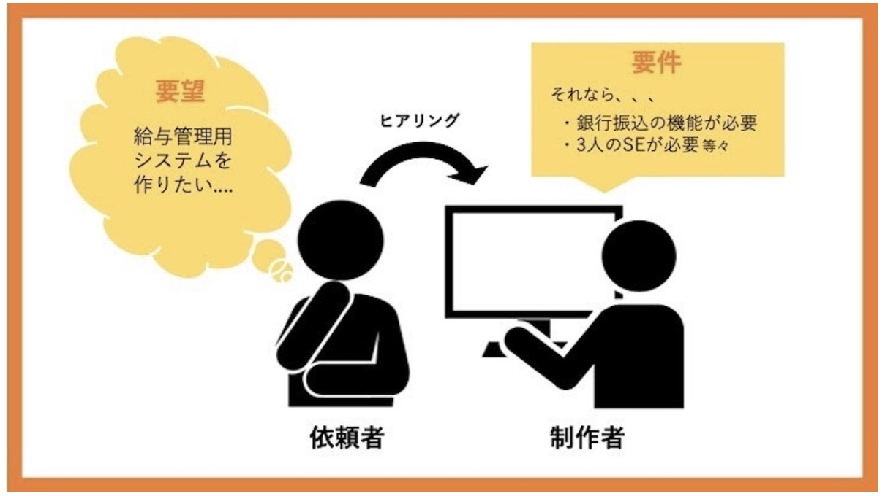
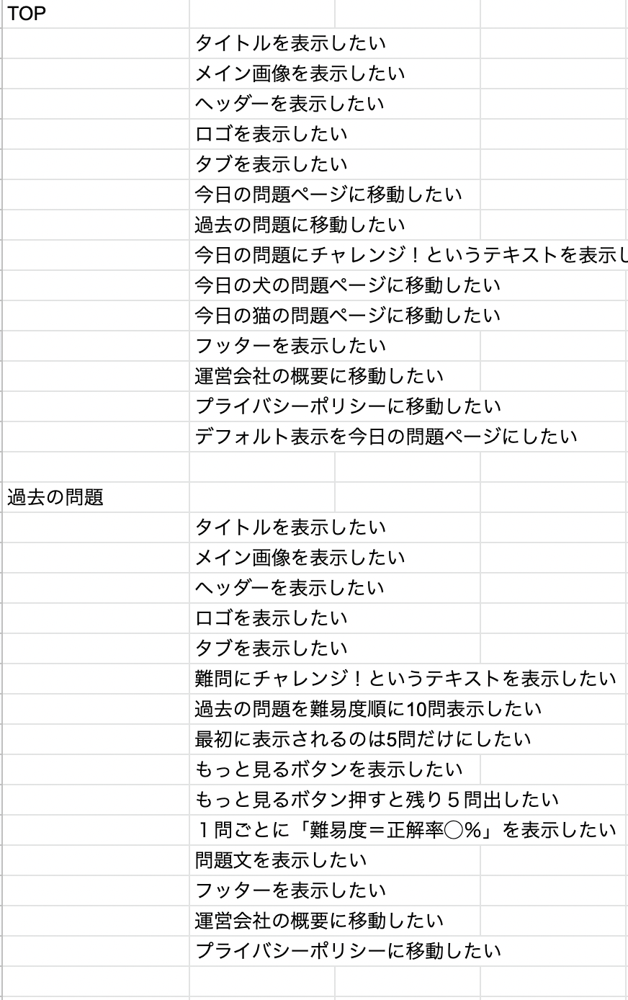
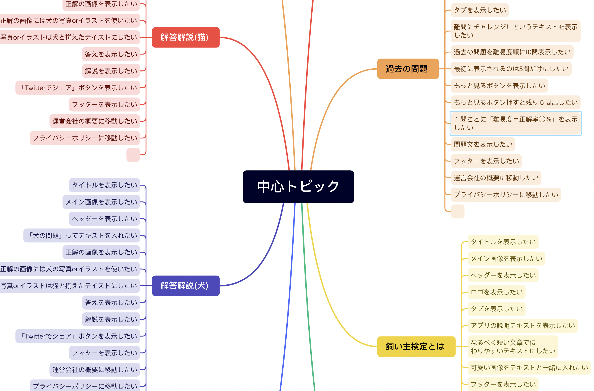
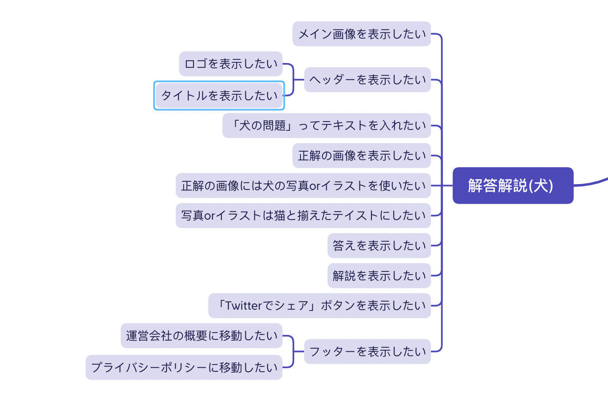
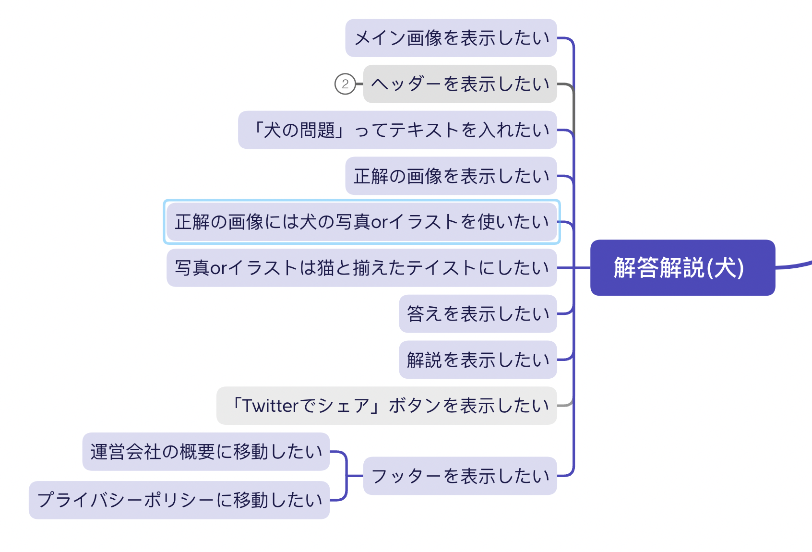
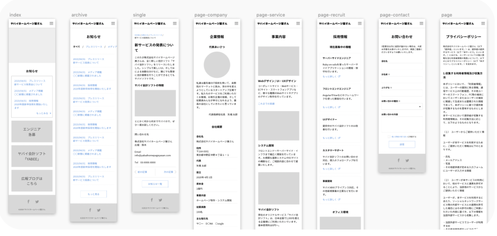
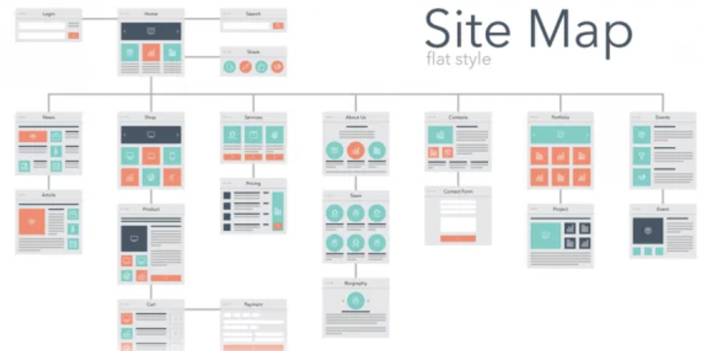
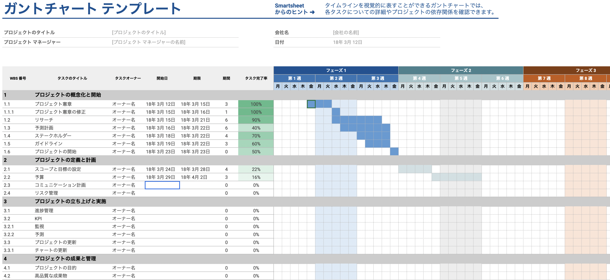

# 要件定義とは

クライアントのニーズである要求定義を、開発するシステムでどのように実現していくか？必要な要件をまとめたもの。

・開発目的

・予算

・必要な機能

・スケジュール（納期）

・必要な人員（工数）

## 手順書

### 1.ページ毎にやりたいことをスプシに書き出す。合計100個

> ページ名の行には書き込まない(後でフォーマットが崩れる)

### 2.作成したやりたいことをコピーして"Xmaind"にペースト

### 3.Xmaindでページの階層とコンポーネント毎に並び替え

### 4.XmaindでMVPを見える化

> 初期開発では実装しないものの色をグレーに変更してタグを折りたたんで見やすくする

### 5.ワイヤーフレームを作成(単体画面の設計図)

ワイヤーフレームとは、webページのレイアウトを定める設計図のことです。

Xmaindで作成した要素をFigmaで配置し、具体化する

> フロントにデザインを一任するなら色、形、画像はここでは入れない

> この作業はチームで集まって紙ベースでサクッと作成、編集を繰り返すと時間とコストを削減することができる

> ここで作成したものはあくまで作成段階のもの、組織としての意思決定をするもの

Google Analyticsを連携する場合に守ること

1.マテリアルデザインを採用する

[Googleが推奨する「マテリアルデザイン](https://tayori.com/blog/material-design/)

[Appleのガイドライン](https://developer.apple.com/jp/app-store/review/guidelines/)

[iOSやAndroidアプリ開発のGoodPractice](https://www.slideshare.net/mokemokechicken/iosandroidgoodpractice)

[備忘録『iOSアプリ設計パターン入門』](https://zenn.dev/basurao/scraps/9a54f3d63cd308)

2.アンチパターンの確認

[Androidアンチパターン](https://honto.jp/netstore/pd-book_28635072.html)

[アンチパターンから考えるアプリケーションデザインの理想形](https://goodpatch.com/blog/appdesign-antipatterns)

### 6.サイトマップを作成(アプリ全体の設計図)

サイトマップとは、サイト全体のページ構成を地図のように一覧で記載しているページのことです。

> PV数を稼ぎたいなら回遊率を上げる設計にする

PVとは、Webサイトで表示されたページの閲覧数を指しています。Webサイト全体や特定のページがどれくらいユーザーに閲覧されたのかを知る指標で、ユーザーが特定のページを閲覧した回数を知ることができます。

PVのカウントの仕方は非常にシンプルで、Webサイトにアクセスしたユーザーが1ページを閲覧するごとにPVがカウントされ、3ページ見た場合は3PVです。また、ページの更新や「戻る」ボタンによって前ページに戻った場合もカウントに入ります。

### 7.選定項目の決定

・技術選定(言語)

・サーバー選定

・DB選定

> プロジェクトが急ぎの場合はここまで終わればコードが書き始められる

### 8.ガントチャートの作成

ガントチャート（Gantt chart）とは、プロジェクト管理や生産管理などで工程管理に用いられる表のことです。

[ガントチャートテンプレ](https://docs.google.com/spreadsheets/d/1PoZLLxro0nAYeRhapz2jrGL6aeOnTN66JZw260JYpIs/edit#gid=1115838130)

### 9.資料を作成する

VitePress

